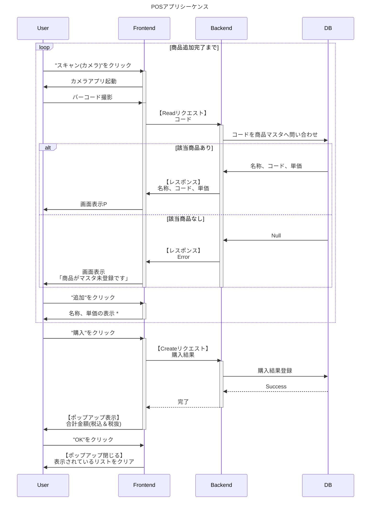

```mermaid
---
title: POSアプリシーケンス
---
sequenceDiagram

participant User
participant Frontend
participant Backend
participant DB

loop 商品追加完了まで
    User->>Frontend:"スキャン(カメラ)"をクリック
    activate Frontend
    Frontend->>User:カメラアプリ起動
    User->>Frontend:バーコード撮影
    deactivate Frontend
    activate Frontend
    Frontend->>Backend:【Readリクエスト】<br>コード
    activate Backend
    Backend->>DB:コードを商品マスタへ問い合わせ
    alt 該当商品あり
        DB->>Backend:名称、コード、単価
        Backend->>Frontend:【レスポンス】<br>名称、コード、単価
        Frontend->>User:画面表示P
    else 該当商品なし
        DB->>Backend:Null
        Backend->>Frontend:【レスポンス】<br>Error
        Frontend->>User:画面表示<br>「商品がマスタ未登録です」
    end
    deactivate Backend
    deactivate Frontend
    User->>Frontend:"追加"をクリック
    activate Frontend
    Frontend->>User:名称、単価の表示 *
    deactivate Frontend
end
User->>Frontend:"購入"をクリック
activate Frontend
Frontend->>Backend:【Createリクエスト】<br>購入結果
activate Backend
Backend->>DB:購入結果登録
DB-->>Backend:Success
Backend-->>Frontend:完了
deactivate Backend
Frontend->>User:【ポップアップ表示】<br>合計金額(税込＆税抜)
deactivate Frontend
User->>Frontend:"OK"をクリック
Frontend->>User:【ポップアップ閉じる】<br>表示されているリストをクリア

```

